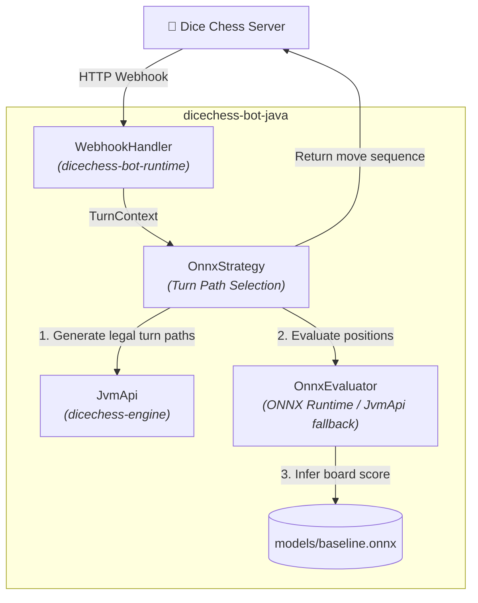

# dicechess-bot-java

[](https://github.com/fortemate/dicechess-bot-java/actions/workflows/ci.yaml)
[](https://sonarcloud.io/summary/new_code?id=fortemate_dicechess-bot-java)
[](https://sonarcloud.io/summary/new_code?id=fortemate_dicechess-bot-java)
[](LICENSE)
[](https://play.jc.id.lv/bots/rabestro/java-baseline)

Official **Java 25 (LTS)** baseline house bot and reference starter template for the [Dice Chess](https://dicechess.net) platform.

Built with [`dicechess-bot-runtime`](https://github.com/fortemate/dicechess-bot-runtime), [`dicechess-engine`](https://github.com/fortemate/dicechess-engine) (JVM API), and Microsoft ONNX Runtime for Java.

## Overview

This repository serves two primary roles:
1. **Platform Baseline Bot**: An official house bot that runs a greedy material-based ONNX model (`models/baseline.onnx`) to provide a baseline rating in the Dice Chess Ladder.
2. **Developer Starter Template**: A lightweight reference implementation for developers building custom AI bots for Dice Chess in Java.

## Key Features

- **Java 25 & JDK HttpServer**: Built on modern Java 25 (LTS) with minimal dependencies and zero heavy frameworks (~64 MB RAM footprint).
- **ONNX Model Evaluation**: Evaluates candidate full-turn move paths using ONNX value models (`models/baseline.onnx`) with JvmApi engine heuristic fallback.
- **Bot Runtime Integration**: Uses `lv.id.jc:dicechess-bot-runtime` for HMAC-SHA256 signature verification, webhook handshakes, and `TurnContext` processing.
- **Engine Rules Integration**: Uses the `com.fortemate:dicechess-engine_3:0.3.0` JvmApi facade from Maven Central for strict DFEN parsing, legal turn path generation, and game state evaluation.

## Architecture



## Environment Variables

| Variable                   | Default                | Description                                                |
|----------------------------|------------------------|------------------------------------------------------------|
| `DICECHESS_WEBHOOK_SECRET` | `""`                   | Per-bot secret token for HMAC-SHA256 webhook verification  |
| `PORT`                     | `8080`                 | HTTP server listening port (Koyeb / Cloud Run / VPS)       |
| `MODEL_PATH`               | `models/baseline.onnx` | Path to the ONNX value model file                          |
| `JAVA_OPTS`                | `-Xmx256m --enable-native-access=ALL-UNNAMED` | JVM memory, GC, and native access settings |

## Quick Start

### Prerequisites
- Java 25 (LTS) & Maven 3.9+ (or [`mise`](https://mise.jdx.dev/))

### 1. Build locally
```bash
mise run check
# or using Maven directly:
mvn clean package
```

### 2. Run locally
```bash
export DICECHESS_WEBHOOK_SECRET="your-secret-token"
export MODEL_PATH="models/baseline.onnx"
java -jar target/dicechess-bot-java-1.0.5-SNAPSHOT.jar
```

### 3. Run via Docker Container
```bash
docker build -t dicechess-bot-java .
docker run -p 8080:8080 \
  -e DICECHESS_WEBHOOK_SECRET="your-secret-token" \
  ghcr.io/fortemate/dicechess-bot-java:latest
```

## Registering & Connecting Your Bot ([`bots.jc.id.lv`](https://bots.jc.id.lv))

To connect your bot to the public Dice Chess platform via Webhook:

### 1. Register a durable identity (`POST /bot/register`)
```bash
curl -X POST "https://play-api.jc.id.lv/bot/register" \
  -H "Content-Type: application/json" \
  -d '{"team": "your-team", "name": "your-bot-name"}'
```
Response:
```json
{
  "token": "BEARER_TOKEN_STRING",
  "team": "your-team",
  "name": "your-bot-name",
  "id": "bot:team:your-team:your-bot-name"
}
```
> ⚠️ **Note**: Save the `token` immediately — it is shown only once!

### 2. Register your Webhook URL (`POST /bot/webhook`)
Deploy your bot container to a public HTTPS host (e.g. [Koyeb](https://koyeb.com), Cloud Run, or VPS) and register the webhook:
```bash
curl -X POST "https://play-api.jc.id.lv/bot/webhook" \
  -H "Authorization: Bearer BEARER_TOKEN_STRING" \
  -H "Content-Type: application/json" \
  -d '{"url": "https://your-bot-app.koyeb.app/api/webhook"}'
```
Response:
```json
{
  "url": "https://your-bot-app.koyeb.app/api/webhook",
  "secret": "WEBHOOK_HMAC_SECRET_64_HEX_CHARS"
}
```

### 3. Configure `DICECHESS_WEBHOOK_SECRET`
Set `DICECHESS_WEBHOOK_SECRET="WEBHOOK_HMAC_SECRET_64_HEX_CHARS"` in your bot host's environment variables to enable cryptographic HMAC-SHA256 payload verification.

### 4. Join the Rating Ladder & Open to Humans
```bash
# Join the Glicko-2 rating ladder
curl -X POST "https://play-api.jc.id.lv/bot/ladder/join" \
  -H "Authorization: Bearer BEARER_TOKEN_STRING"

# Open to human players from the Bot Catalog
curl -X POST "https://play-api.jc.id.lv/bot/open-to-humans" \
  -H "Authorization: Bearer BEARER_TOKEN_STRING" \
  -H "Content-Type: application/json" \
  -d '{"description": "Your bot description here."}'
```

## Creating Custom Strategies

To create a custom bot strategy:
1. Implement the `Strategy` interface in `src/main/java/com/fortemate/dicechess/bot/`:
   ```java
   public class MyCustomStrategy implements Strategy {
       @Override
       public List<String> chooseMoves(TurnContext context) {
           // Your move selection logic here
       }
   }
   ```
2. Pass your strategy to `WebhookHandler` in `Main.java`.

## Contributing & Security

Contributions are welcome! Please read [CONTRIBUTING.md](CONTRIBUTING.md) for details on our CLA and development workflow.
For reporting vulnerabilities, see our [Security Policy](SECURITY.md).

## License

[GNU Affero General Public License v3.0 (AGPL-3.0)](LICENSE).
Model files (`models/*.onnx`) are proprietary platform evaluation artifacts.
